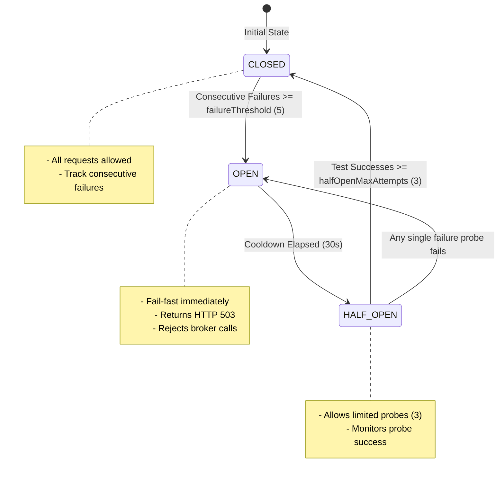

# 🏗️ System Architecture

OrionOps utilizes a split-database approach: **MongoDB** acts as the high-write transactional store for raw logging and client settings, while **PostgreSQL** handles time-bucketed aggregation queries for high-performance dashboard reads.

```text
                  ┌────────────────────────────────────────┐
                  │          Client Applications           │
                  └──────────────────┬─────────────────────┘
                                     │
                        POST /api/hit (with API Key)
                                     ▼
                  ┌────────────────────────────────────────┐
                  │          Express Ingest App            │ (Port 3000)
                  │   - Validate API Key (MongoDB)         │
                  │   - Rate Limit (Express Rate Limit)    │
                  │   - Circuit Breaker check              │
                  └──────────────────┬─────────────────────┘
                                     │ Asynchronous Publish
                                     ▼
                  ┌────────────────────────────────────────┐
                  │               RabbitMQ                 │ (Queue: api_hits)
                  └──────────────────┬─────────────────────┘
                                     │ Consumer Subscription
                                     ▼
                  ┌────────────────────────────────────────┐
                  │          Background Consumer           │
                  │   - Idempotency & Zod Validation       │
                  │   - Save Raw Hits to MongoDB           │
                  │   - Fallback-Safe Upsert to Postgres   │
                  └───────────┬──────────────────┬─────────┘
                              │                  │
                              ▼                  ▼
                     ┌──────────────┐   ┌──────────────┐
                     │   MongoDB    │   │  PostgreSQL  │ (Aggregated
                     │ (Raw Logs &  │   │  (Metrics &  │  endpoint stats)
                     │  Metadata)   │   │  Analytics)  │
                     └──────────────┘   └──────────────┘
```

---

## 🛠️ Advanced System Design & Fault Tolerance Patterns

OrionOps implements state-of-the-art distributed systems patterns to achieve extreme resilience, fault isolation, and sub-millisecond API response latency.

### 🔌 1. Circuit Breaker Pattern

OrionOps uses a custom state-machine CircuitBreaker to isolate telemetry ingestion from downstream message broker failures. This prevents cascading crashes and resource exhaustion when RabbitMQ is congested or offline.



- **🟢 CLOSED State**: In normal operation, requests flow through to RabbitMQ. Successful publishes reset the failure count.
- **🔴 OPEN State**: If publishes fail consecutively `5` times, the circuit trips. The publisher fails fast, returning a `503 Service Unavailable` with `retryAfter: '30 seconds'` parameters immediately. No connection resource is wasted.
- **🟡 HALF_OPEN State**: After a `30,000ms` cooldown, the circuit enters `HALF_OPEN`. It allows exactly `3` probe attempts. If all `3` probe requests succeed, the breaker resets to `CLOSED`. If any single request fails, the breaker trips back to `OPEN`, starting a new cooldown cycle.

---

### 📂 2. Polyglot Persistence Pattern

OrionOps splits its data footprint based on access characteristics:

- **Write-Heavy Ingest Log (MongoDB)**: Raw telemetry hits require sub-millisecond writes and dynamic document structures. Mongoose schemas model client/key settings, indexing key IDs and values for validation.
- **Read-Heavy Query Aggregates (PostgreSQL)**: Time-series dashboards need relational joins, filters, and fast sorted ranges. Background processing updates PostgreSQL in optimized tables using native database upserts.

---

### 🔄 3. Asynchronous Decoupling (Producer-Consumer)

By buffering event logging using RabbitMQ queue structures, OrionOps guarantees that the client ingestion request experiences low latency. The Express gateway acts as a lightweight publisher that pushes hits to the broker and returns an immediate `202 Accepted` status.

---

### ⏱️ 4. Exponential Backoff with Jitter Retry Strategy

Transient system errors (network drops, buffer overflows, broker socket resets) are retried using a RetryStrategy.

- **Transient Classification**: Analyzes error codes (`ECONNRESET`, `ECONNREFUSED`, `ETIMEDOUT`, etc.) to isolate retryable exceptions.
- **Exponential Delay**: Computes backoff duration: `t = base * 2^attempt`
- **Randomized Jitter**: Multiplies the delay by a randomized jitter factor (`0.3`) to prevent the **Thundering Herd** problem (where concurrent clients retry in lockstep, repeatedly knocking over a recovering node).

---

### 🆔 5. Idempotent Consumer (Deduplication Cache)

To support at-least-once message delivery guarantees without creating duplicate records, the consumer maintains a rolling deduplication cache of processed message IDs. If an event ID is already present in the cache, it is safely acknowledged and discarded without re-processing.

---

### 🧱 6. Repository & Dependency Injection (DI) Patterns

To ensure clean code boundaries and ease unit testing:

- **Repository Pattern**: Abstracted database interfaces encapsulate raw queries.
- **DI Container Pattern**: Instantiated to wire up services and inject repository instances dynamically.

---

## 📊 Analytics & Aggregation Engine

### ⏱️ Time Buckets

Incoming events round their timestamp to the nearest hour using the `getTimeBucket` helper:

```javascript
getTimeBucket(timestamp, interval = 'hour') {
    const date = new Date(timestamp);
    date.setMinutes(0, 0, 0);
    return date;
}
```

### ⚡ PostgreSQL UPSERT Operation

When a metric record is written, PostgreSQL handles unique bucket conflicts:

```sql
INSERT INTO endpoint_metrics (
    client_id, service_name, endpoint, method, total_hits, error_hits,
    avg_latency, min_latency, max_latency, time_bucket
)
VALUES ($1, $2, $3, $4, $5, $6, $7, $8, $9, $10)
ON CONFLICT (client_id, service_name, endpoint, method, time_bucket)
DO UPDATE SET
   total_hits = endpoint_metrics.total_hits + EXCLUDED.total_hits,
   error_hits = endpoint_metrics.error_hits + EXCLUDED.error_hits,
   avg_latency = (
        (endpoint_metrics.avg_latency * endpoint_metrics.total_hits) +
        (EXCLUDED.avg_latency * EXCLUDED.total_hits)
    ) / (endpoint_metrics.total_hits + EXCLUDED.total_hits),
    min_latency = LEAST(endpoint_metrics.min_latency, EXCLUDED.min_latency),
    max_latency = GREATEST(endpoint_metrics.max_latency, EXCLUDED.max_latency),
    updated_at = CURRENT_TIMESTAMP
```
